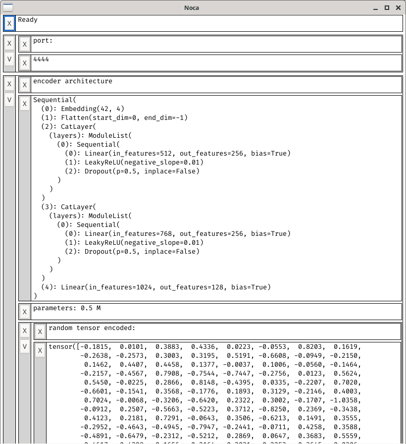

# Notebook Canvas (noca)

This is a sort of output display replacement for notebook interfaces like jupyter. Its pretty much brutally pragmatic. I made it for myself as one tool to help replace jupyter lab. It uses gtk4

When you open it, it displays a port (also see its `--help` switch information, it has a `--port` switch). Connect to that port via a socket. Whatever you send on that socket will be executed via `exec(...)`

The `clientlib.py` module is a helper interface for the sockets interface and provides commands for easily sending common patterns to a `noca.py` instance



## Usage

Use the `clientlib.py` probably, or look at `clientlib.py` for what to send to `noca.py`

Here's a snippet from the work I took the screenshot above on:

```py
add_container_with(
  'encoder architecture',
  repr(enc_arch), 
  f'parameters: {round1(param_count(enc_arch)/1e6)} M', 
  [
    'random tensor encoded:',
    repr(enc_arch(itensor(make_untransformed())))
  ],
  replace=True
)
```

Another section has:
```py
disp = container_display(name='uniformization', replace=True)
disp.add_text('uniformizing...')
step_disp = disp.text_display('')
loss_disp = disp.text_display('')
# then later, in a loop:
step_disp.update(f'{round(100*step/step_count)}%')
loss_disp.update(f'loss {round2(log10(avg_loss))}')
```

Here are some of the relevant signatures from above:

* `add_container_with(*stuff:str|list|dict, **kwargs) -> SimpleNamespace`
* `text_display(initial_text:str='', name:str|None=None, **kwargs) -> SimpleNamespace`
* `container_display(name:str|None=None, **kwargs) -> SimpleNamespace`

There are also these in `clientlib.py`:

* `quit_app(port=global_port, **kwargs)`
* `is_ready(port=global_port, **kwargs)`
* `remove_block(uid, *, port=global_port, **kwargs)`
* etc (see `clientlib.py`)

Anything you can make in pygtk, you can make via the sockets interface because the interface just sends stuff to be executed


## Dependencies

This needs:
* `pygobject` use `pip install pygobject` see https://pypi.org/project/PyGObject/
* `gtk4`

And that's it, I think. Note that you do need gtk4, not earlier versions

If you use pacman, use `pacman -S python-pygobject`, or create a venv or something


## Future work

I might try making an AppImage if its possible to bunde all of pygtk (and gtk4?) into one

There are lots of bugs and stuff that just doesn't work. Those need to be fixed, and I'll fix them at least for myself at some point

GTK, as always, creeps me out, so if ever possible / feasible I might switch to a different toolkit (I originally used tk and that was not powerful enough)

Sockets interface probably really needs to be reworked. Clientlib should more easily be able to keep a socket open instead of reconnecting all the time

Future features (when I get to it):

* Images
* Plots
* Text input blocks
* Tabbed blocks maybe
* A block to input and execute python directly in noca
* A terminal-emulator block (would be cool but time consuming to write, I think)
* Misc useful widgets

